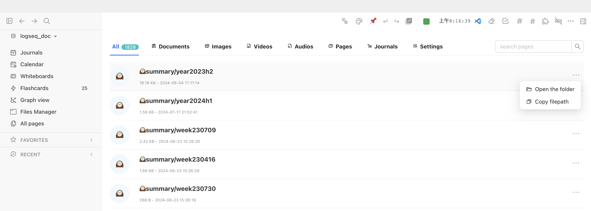
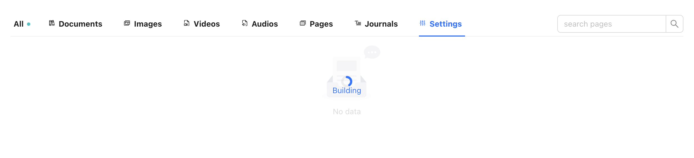

# Logseq FileManager Plugin

[Chinese](README_CN.md) / [English](README.md)

This plugin is designed to help you manage the attachments and page files generated during daily document processing efficiently.

## How to Launch
You can launch the file manager in any of the following ways:
- Click the "FileManager" button on the left sidebar
- Use the shortcut key:
  - Windows: Ctrl + Shift + Enter
  - macOS: Cmd + Shift + Enter

- After installation, the file manager will automatically start building the database. During this process, the message "Building..." will appear in the upper left corner of the file manager. Please do not exit Logseq until this message disappears.
- ~~**Please Note: The plugin currently reads the Logseq document directories strictly according to the default configuration, categorizing various files into directories such as pages, journals, and assets; future updates will attempt to optimize by reading user configurations.**~~
- 

- You can also manually click on Settings to rebuild the data and refresh the database.

## Feature Introduction
> Discover and experience more features awaiting your exploration.

1. **Card View and List View**  
   - You can switch the display method in settings, displaying files in card or list form, providing a more intuitive file preview and operation interface.
   - 
   - 卡片与列表切换：

2. **Open Files**  
   - Directly open Logseq files within Logseq.
   - Attachment files will be opened based on their file type: PDF files will open within Logseq, while other file types will open using the default system program.

3. **Copy File Path**  
   - One-click copy of the complete file path for quick access in other applications.

4. **Search Files**  
   - A quick search function to help you locate the required files among a large number of files.

5. **File Preview**
   - You can click on the file name to preview the file content. Please note: Due to browser limitations, some files may not support preview.
   - 
   - Double-click the filename to copy the filename for previewed files.

6. **Right-Click Menu**
  - While viewing the list, users can trigger a comprehensive menu of functions by right-clicking on any file entry. This menu offers quick access to common file operations, making file management more efficient and convenient.
  - 
  

### Development Plan

Here are the translated TODO items into English with detailed descriptions and usage scenarios, following the same Markdown format:

### TODO List

- [ ] **1. Implement File Renaming Feature**
  - **Description**: Develop a user-friendly file renaming mechanism that allows users to easily change file names through an intuitive interface, enhancing the flexibility and personalization of file management.
  - **Usage Scenario**: This feature will be very useful when users need to organize a large number of files or update file names according to project progress to reflect the latest status.

- [ ] **2. Add the Ability to Delete Unnecessary Attachments**
  - **Description**: Design an intelligent and efficient capability to clean up unnecessary attachments, helping users identify and remove unwanted attachments, freeing up storage space, and maintaining a tidy file library.
  - **Usage Scenario**: During daily document editing, after project completion, or during annual file organization, users can quickly clean up outdated or irrelevant file attachments with this feature.

- [ ] **3. Support URL Data as Virtual Attachment Management**
  - **Description**: Develop a mechanism to manage URL links as virtual attachments, allowing users to manage these online resources like local files, improving the accessibility and organization of resources.
  - **Usage Scenario**: When users need to integrate resources scattered across different websites or need to save a large number of online documents and data, this feature will greatly simplify the management process.

- [ ] **4. Support Card Data Management and Display**
  - **Description**: Build a CARD data management system that offers more advanced horizontal management capabilities than the existing Logseq flashcards, including the creation, editing, categorization, and display of data.
  - **Usage Scenario**: Suitable for learners and researchers who need to organize and review complex information, especially during language learning, exam review, or project planning.

- [ ] **5. Support Adding Default Attributes When Creating a Page, Such as createdAt**
  - **Description**: Implement a feature that allows users to automatically add default attributes, such as creation time and author, when creating a new page, simplifying the page initialization process and maintaining consistency of information.
  - **Usage Scenario**: For teams and projects that require strict document management processes, this feature can ensure that all pages include necessary metadata for future retrieval and auditing.

## Supported Languages

- Chinese
- English
- Japanese

You can change the language in Logseq's settings to take effect.

## Thanks
- The tab functionality of this plugin was inspired by: [logseq-assets-plus](https://github.com/xyhp915/logseq-assets-plus)
- The card functionality of this plugin was inspired by: [logseq-cardbox](https://github.com/sosuisen/logseq-cardbox)

## Support Development

If you like this plugin, please consider donating to support its continued development.

