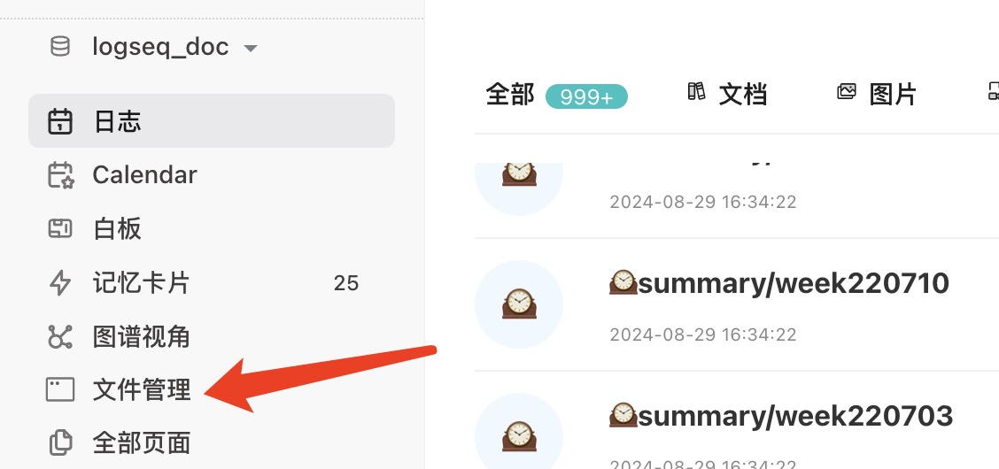
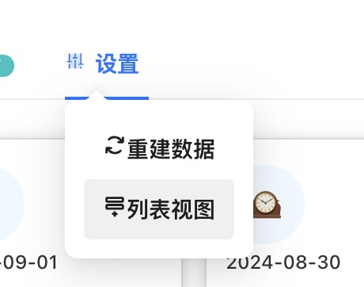

# Logseq 文件管理器插件

[Chinese](README.md) / [English](README_EN.md)

本插件专为提高您管理日常文档和附件的效率而设计，帮助您轻松处理和组织与Logseq相关的文件。

## 如何启动
您可以通过以下几种简便的方式启动文件管理器：
- 点击左侧边栏的“文件管理器”按钮
- 使用快捷键：
  - Windows系统：Ctrl + Shift + Enter
  - macOS系统：Cmd + Shift + Enter

- 安装完成后，文件管理器将自动开始构建数据库。在这个过程中，文件管理器左上角会显示“正在构建...”的提示。请耐心等待，直到该提示消失后再退出Logseq。
- 

- 您也可以在设置中手动点击“重建数据”，以刷新数据库。

## 功能介绍
1. **打开文件**  
   - 直接在Logseq中打开Logseq文件。
   - 附件文件将根据文件类型打开：PDF文件将在Logseq内部打开，其他类型的文件将通过系统默认程序打开。

2. **复制文件路径**  
   - 一键复制文件的完整路径，方便在其他应用中快速访问。

3. **检索文件**  
   - 快速搜索功能，帮助您在大量文件中迅速定位所需文件。

4. **卡片视图和列表视图**  
   - 可在设置中切换展示方式，以卡片或列表形式展示文件，提供更直观的文件预览和操作界面。
   - 
   - 卡片与列表切换：

5. **文件预览**
   - 可点击文件名称预览文件内容, 点击空白地方可退出预览。请注意：由于浏览器限制，部分文件可能无法预览。
   - 

### 开发计划

- [ ] 实现文件重命名功能
- [ ] 添加删除无用附件的功能

## 支持语言

- 中文
- 英语
- 日语

您可以通过更改Logseq的设置来切换语言，以使上述更改生效。

## 感谢

- 本插件tab能力参考插件：[logseq-assets-plus](https://github.com/xyhp915/logseq-assets-plus)
- 本插件card能力参考插件：[logseq-cardbox](https://github.com/sosuisen/logseq-cardbox)

## 支持开发

如果您喜欢这个插件，请考虑捐赠以支持其持续开发。

