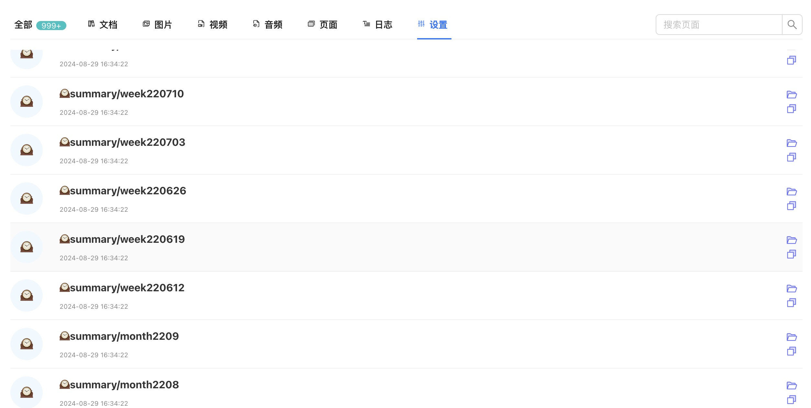
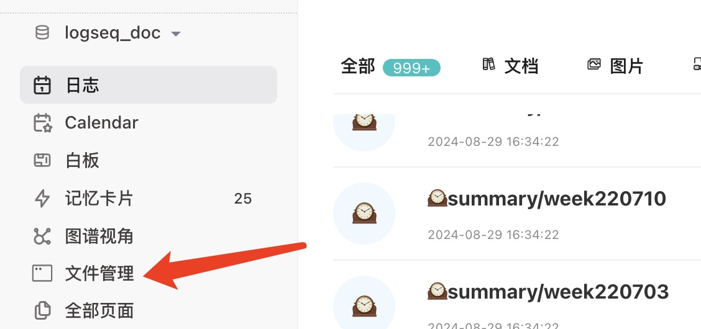
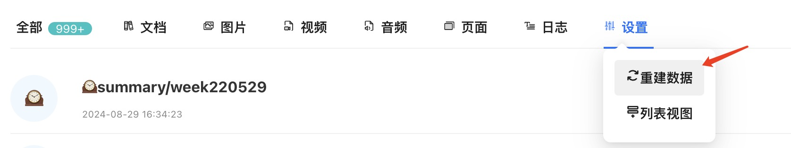
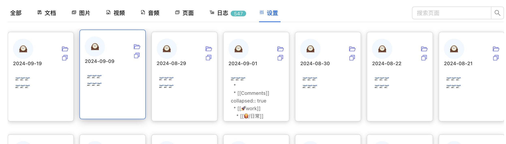
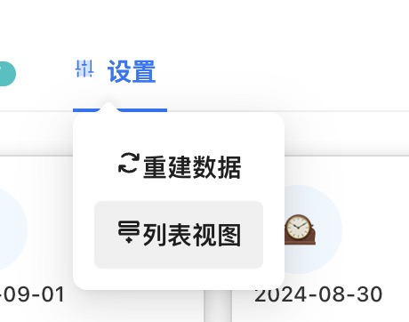
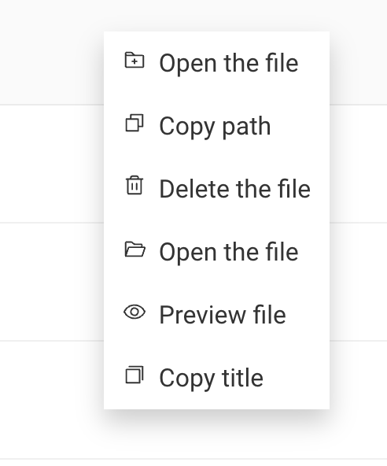
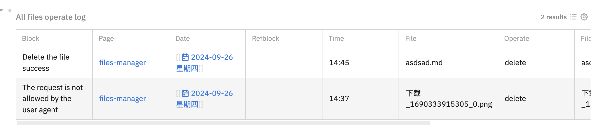
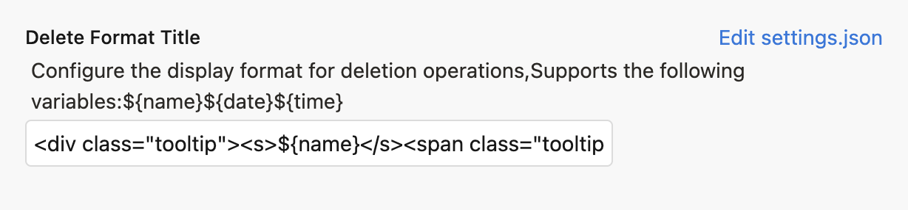
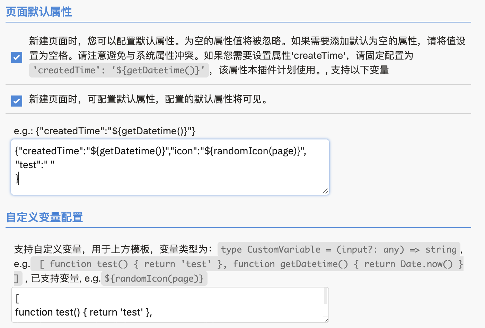

# Logseq 文件管理插件

[Chinese](README_CN.md) / [English](README.md)

本插件专为提高您管理日常文档和附件的效率而设计，帮助您轻松处理和组织与Logseq相关的文件。

- ## 如何启动
  您可以通过以下几种简便的方式启动文件管理器：
- 点击左侧边栏的“文件管理”按钮
- 使用快捷键：
	- Windows系统：Ctrl + Shift + Enter
	- macOS系统：Cmd + Shift + Enter
	  
	  
- 安装完成后，文件管理器将自动开始构建数据库。在这个过程中，文件管理器左上角会显示“正在构建...”的提示。请耐心等待，直到该提示消失后再退出Logseq。
- ~~**请注意：本插件目前对Logseq文档的目录读取，严格按照默认配置，如：pages、journals、assets目录分类各种文件；后续会尝试优化，读取用户配置**~~
- 
- 您也可以在设置中手动点击“重建数据”，以刷新数据库。
  
  
- ## 功能介绍
>  **更多功能&使用分享 [👉🏻👉🏻here](https://github.com/duiliuliu/logseq-plugin-files-manager/discussions)**

1. **卡片视图和列表视图**
- 可在设置中切换展示方式，以卡片或列表形式展示文件，提供更直观的文件预览和操作界面。
- 
- 卡片与列表切换：
  
2. **右键菜单**
- 用户在浏览列表视图时，可以通过右键点击任何文件条目来触发一个全面的功能菜单。这个菜单提供了快速访问常用文件操作的途径，使得管理文件变得更加高效和便捷。
- 
  
3. **打开文件**
- 直接在Logseq中打开Logseq文件。
- 附件文件将根据文件类型打开：PDF文件将在Logseq内部打开，其他类型的文件将通过系统默认程序打开。
  
4. **复制文件路径**
- 一键复制文件的完整路径，方便在其他应用中快速访问。
  
5. **检索文件**
- 快速搜索功能，帮助您在大量文件中迅速定位所需文件。
  
6. **文件预览**
- 可点击文件名称预览文件内容, 点击空白地方可退出预览。请注意：由于浏览器限制，部分文件可能无法预览。
- 
- 对于预览的文件，双击文件名可复制文件名
  
7. **文件删除**
- 点击“删除”按钮，文件将被永久移除，所有关联的文件名将自动替换。操作过程会被详细记录。
- 删除后的文档引用样式：
- 删除后的文档集中引用样式：
- 操作日志记录：
- 您也可以在设置中自定义删除样式模板，满足个性化需求 
  
8. **新建页面的动态属性配置**
- 赋予您的页面预配置的默认属性，这些属性将在创建时初始化。
- 通过为新创建的页面设置默认属性来增强您的工作流程。借助如 randomIcon 这样的动态变量支持，您可以进一步定制页面。此功能使您能够创建具有丰富、可自定义属性的页面，以适应您的需求。
- 
  

9. 隐藏空白日记页

> 更多功能,期待您的探索和体验.**更多功能&使用分享 [👉🏻👉🏻here](https://github.com/duiliuliu/logseq-plugin-files-manager/discussions)**
- ### 开发计划

- [ ] **1. 实现文件重命名功能**
	- **描述**：开发一套用户友好的文件重命名机制，允许用户通过直观的操作界面轻松更改文件名称，以提高文件管理的灵活性和个性化。
	- **使用场景**：当用户需要整理大量文件，或者需要根据项目进度更新文件名以反映最新状态时，此功能将非常有用。
- [x] **2. 添加删除无用附件的功能**
	- **描述**：设计一个智能且高效的无用附件清理能力，帮助用户识别并删除不再需要的附件，释放存储空间，保持文件库的整洁。
	- **使用场景**：日常文档编辑，或者在项目结束后，或者在进行年度文件整理时，用户可以利用此功能快速清理过时或不再相关的文件附件。
- [ ] **3. 支持URL数据，作为虚拟附件管理**
	- **描述**：开发一种机制，将URL链接作为虚拟附件进行管理，允许用户像管理本地文件一样管理这些在线资源，提高资源的可访问性和组织性。
	- **使用场景**：当用户需要整合分散在不同网站上的资源，或者需要保存大量的在线文档和数据时，此功能将极大地简化管理过程。
- [ ] **4. 支持card数据管理和展示**
	- **描述**：构建CARD数据管理系统，提供比现有Logseq闪卡更先进的横向管理能力，包括数据的创建、编辑、分类和展示。
	- **使用场景**：适用于需要进行复杂信息组织和回顾的学习者和研究人员，特别是在进行语言学习、考试复习或项目规划时。
- [ ] **5. 支持page创建时，添加默认的属性，比如createdAt**
	- **描述**：实现一个功能，允许用户在创建新页面时自动添加默认属性，如创建时间、作者等，以简化页面初始化过程并保持信息的一致性。
	- **使用场景**：对于需要严格文档管理流程的团队和项目，此功能可以确保所有页面都包含必要的元数据，便于未来的检索和审计。
- ## 支持语言
- 中文
- 英语
- 日语
  
  您可以通过更改Logseq的设置来切换语言，以使上述更改生效。
- ## 感谢
- 本插件tab能力参考插件：[logseq-assets-plus](https://github.com/xyhp915/logseq-assets-plus)
- 本插件card能力参考插件：[logseq-cardbox](https://github.com/sosuisen/logseq-cardbox)
- ## 支持开发
  
  如果您喜欢这个插件，请考虑捐赠以支持其持续开发。
  
  
