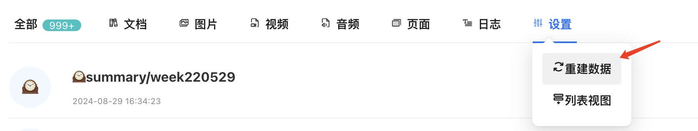

# Logseq FileManager Plugin

[Chinese](README.md)) / [English](README_EN.md)

This plugin is designed to help you manage the attachments and page files generated during daily document processing efficiently.

## How to Launch
You can launch the file manager in any of the following ways:
- Click the "FileManager" button on the left sidebar
- Use the shortcut key:
  - Windows: Ctrl + Shift + Enter
  - macOS: Cmd + Shift + Enter

- After installation, the file manager will automatically start building the database. During this process, the message "Building..." will appear in the upper left corner of the file manager. Please do not exit Logseq until this message disappears.
- 

- You can also manually click on Settings to rebuild the data and refresh the database.

## Feature Introduction
1. **Open Files**  
   - Directly open Logseq files within Logseq.
   - Attachment files will be opened based on their file type: PDF files will open within Logseq, while other file types will open using the default system program.

2. **Copy File Path**  
   - One-click copy of the complete file path for quick access in other applications.

3. **Search Files**  
   - A quick search function to help you locate the required files among a large number of files.

4. **Card View and List View**  
   - You can switch the display method in settings, displaying files in card or list form, providing a more intuitive file preview and operation interface.

5. **File Preview**
   - You can click on the file name to preview the file content. Please note: Due to browser limitations, some files may not support preview.

### Development Plan

- [ ] Implement file renaming functionality
- [ ] Add functionality to delete unnecessary attachments

## Supported Languages

- Chinese
- English
- Japanese

You can change the language in Logseq's settings to take effect.

## Support Development

If you like this plugin, please consider donating to support its continued development.

